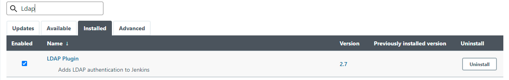
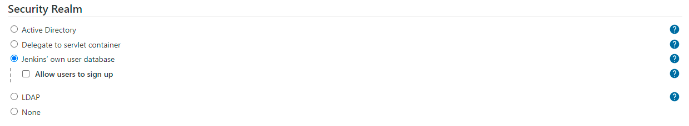
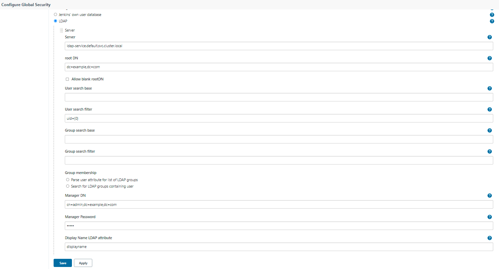
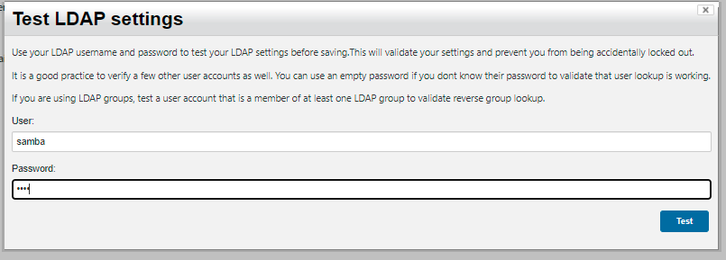
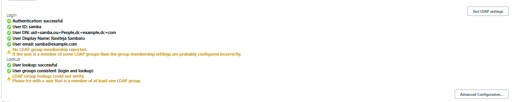

# **LDAP setup for Jenkins authentication**

## LDAP

Delegate all authentication to a configured LDAP server, including both users and groups. This option is more common for larger installations in organizations which already have configured an external identity provider such as LDAP. This also supports Active Directory installations.

Detailed below are the steps for LDAP authentication setup on your Jenkins server on the machine.

* Deploy a new LDAP server on the cluster using [LDAP server YAML configuration](ldap_server.yaml). This deploys phpLDAPadmin which is a GUI for interacting with your LDAP Server.

* Enter the LDAP server pod (aka LDAP database), and add the desired user details (such as user name, mail ID, UID, user password, etc.,) & their groups (such as admins, developers) into it using the following commands.

  A [sample file](ldap_seed_users_groups.ldif) containing users & groups that can be seeded into the LDAP database is provided.

  ```
  kubectl exec -it ldap-0 -- bash
  ldapadd -x -D "cn=admin,dc=example,dc=com" -W
  # Enter password "admin".
  # Press Ctrl+D to complete after pasting the entries such as from the sample file above.
  ```

* Install `LDAP` plugin through the **Manage Jenkins** > **Manage Plugins** view, available to administrators of a Jenkins environment.



## Configuration

* Select LDAP for the Security Realm. You will most likely need to configure some of the Advanced options. There is on-line help available for each option.
  
* Configure through the **Manage Jenkins** > **Configure Global Security** > **Security Realm**



* Click on `LDAP` radio button



## Test LDAP Settings
This button will allow you to check the full LDAP configuration settings which you have defined (as compared with the field validation which only verifies a subset of the configuration)

Clicking this button will display a modal dialog to prompt you to provide a username and password




