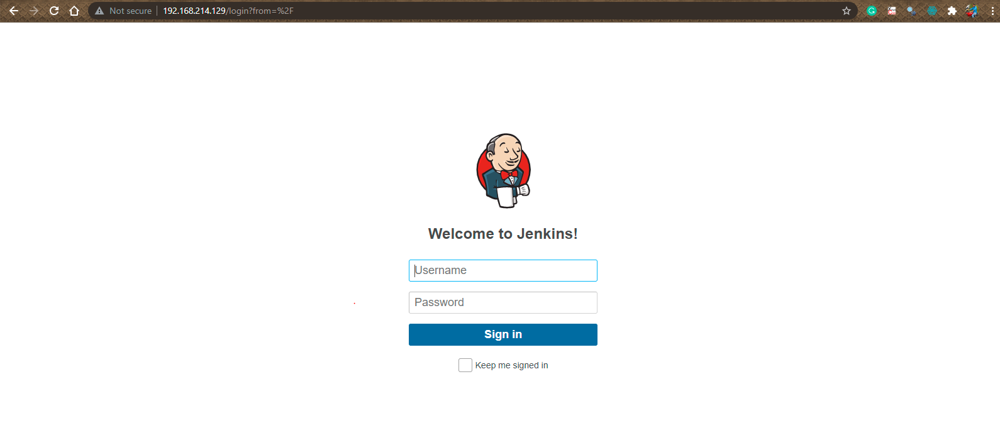

# Installing and Configuring Nginx
In the following example, we will configure an Nginx reverse proxy in front of an Jenkins server.

* Update the APT packet cache and install the Nginx web server via the packet manager

```buildoutcfg
sudo apt update
sudo apt install nginx
```

* Disable the default virtual host, that is pre-configured when Nginx is installed via Ubuntu’s packet manager apt

```buildoutcfg
sudo unlink /etc/nginx/sites-enabled/default
```

* Enter the directory `/etc/nginx/sites-available` and create a reverse proxy configuration file

```buildoutcfg
cd /etc/nginx/sites-available
sudo vi jenkins.conf
```


* Paste the [jenkins.conf](jenkins.conf) Nginx configuration in the text editor. The proxy server redirects all incoming connections on port 80 to the Jenkins server, listening on port 8080
   
   
    Note: Accesses and errors are located in a log files at /var/log/nginx


* Copy the configuration from `/etc/nginx/sites-available` to `/etc/nginx/sites-enabled`. It is recommended to use a symbolic link

```buildoutcfg
sudo ln -s /etc/nginx/sites-available/jenkins.conf /etc/nginx/sites-enabled/jenkins.conf
```

* Test the Nginx configuration file

```buildoutcfg
sudo nginx -t
```

* Open a web browser on your local computer and paste your `public_ip` which will display your Jenkins server homepage.

